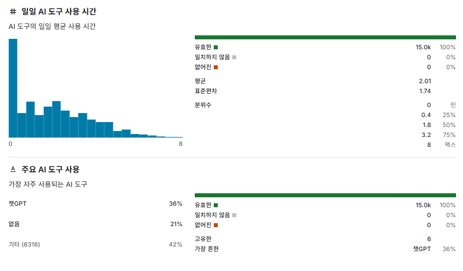
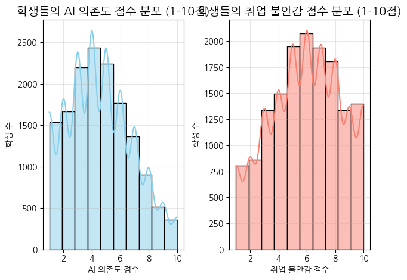
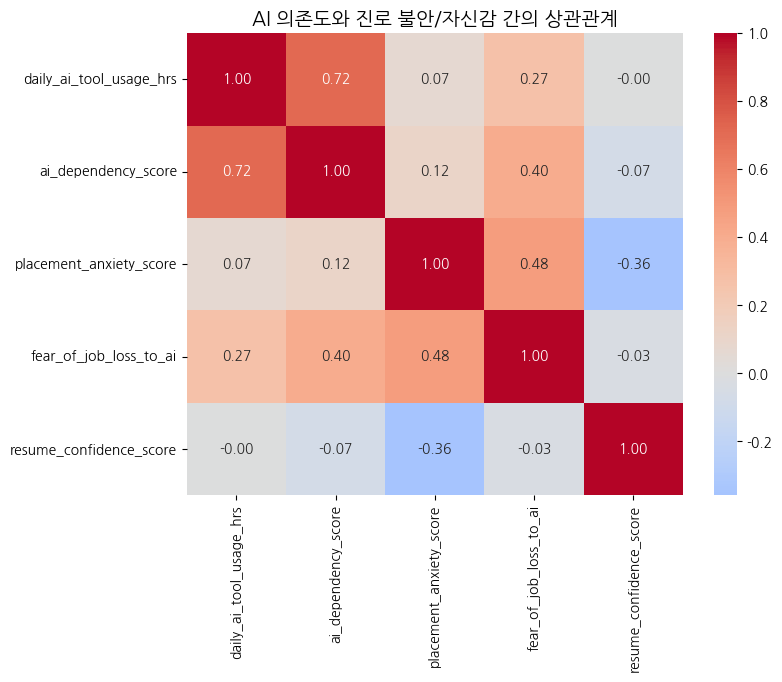
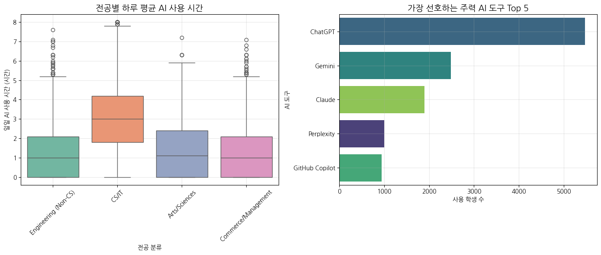
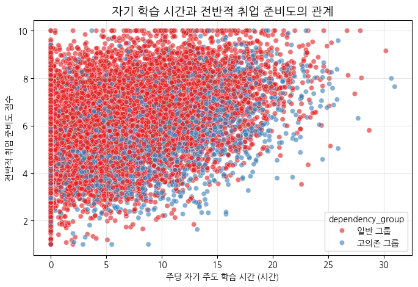

# 🏷 AI 의존도와 진로 불안 - 학생들은 왜 불안해할까?

> 15,000명의 학생 데이터를 분석하여 AI 활용 능력이 취업 불안감에 미치는 영향을 파악하고, 교육적 시사점을 도출하다.



---

## 🛠 사용 기술

`Python` `pandas` `seaborn` `데이터 전처리` `EDA`

## 🔑 핵심 인사이트 3줄 요약

- 💡 **AI 의존도와 불안감의 비례**: AI 의존도가 높을수록 취업 불안감이 비례하여 증가하며(양의 상관관계), 오히려 자신의 실력에 대한 확신(이력서 자신감)은 떨어졌습니다.
- 💡 **전공별 차이**: CS/IT 전공 학생들의 AI 사용 시간이 다른 전공에 비해 압도적으로 길고 편차도 컸으며, 주력 도구는 주로 ChatGPT와 GitHub Copilot이었습니다.
- 💡 **솔루션은 후행 학습**: 고의존 그룹 내에서도 '진로 상담'이나 '순수 자기 주도 학습 시간'을 확보한 학생은 불안감이 확연히 낮게 나타났습니다.

## 🔗 링크

- 📓 [데이터 전처리 및 분석 과정 보기](https://github.com/Dani-dong/analysis-auto-skills)
- 🚀 [Google Colab 분석 노트 원본 보기](https://colab.research.google.com/drive/1Y4OvsEXNQP1zRyON9_h2T1P0WVcGDh6J?usp=sharing)

---

## 1️⃣ 문제 정의 & 기대효과

### 왜 이 분석을 시작했나요?
최근 대학교와 취업 시장에서 생성형 AI(ChatGPT, Copilot 등) 활용이 폭발적으로 늘고 있습니다. 하지만 이로 인해 학생들의 순수 역량은 오히려 후퇴하고 취업에 대한 불안감이 커지고 있다는 'Tool Paradox'를 데이터로 검증하고 싶었습니다.

### 이걸 해결하면 뭐가 좋아지나요?
단순히 "AI를 쓰지 마라"는 비현실적 제재를 넘어, 취업 지원 센터와 코딩 교육 기관이 학생들의 불안감을 근본적으로 해소하고 '진짜 실력'을 키울 수 있는 명확한 교육 액션 아이템을 설계할 수 있습니다.

---

## 2️⃣ 데이터 요약

| 항목        | 내용                                       |
| ----------- | ------------------------------------------ |
| 데이터 출처 | AI Dependency & Career Anxiety Dataset     |
| 데이터 규모 | 약 15,000명 학생 데이터                    |
| 주요 컬럼   | ai_dependency_score, placement_anxiety_score, resume_confidence_score, primary_ai_tools_used |

---

## 3️⃣ 분석 프로세스

```text
[데이터 로드] → [단일/이변량 분석] → [가설 검증] → [그룹 심층 비교] → [전략 제안]
```

---

## 4️⃣ 분석 내용 (WHY-SO-WHAT)

### 📊 분석 1: AI 의존도와 취업 불안감의 역설




**👉 발견한 것**:  
AI 의존도 점수와 취업 불안감(Placement Anxiety) 사이에 뚜렷한 양(+)의 상관관계가 나타났습니다. 특히, AI 의존도 7점 이상의 '고의존 그룹'은 일반 그룹에 비해 이력서/자소서에 대한 자신감(Resume Confidence) 점수가 떨어지는 경향을 보였습니다.

**🔍 왜 그럴까?**:  
AI가 과제의 정답이나 코드를 빠르게 제시해주다 보니, 학생 스스로 '문제 해결을 위한 깊은 사고(Deep Thinking)'를 거칠 기회가 상실됩니다. 화려한 결과물을 내면서도 "이게 내 실력일까?" 하는 의구심이 남아 불안감이 커지는 현상입니다.

---

### 📊 분석 2: 불안감을 낮추는 해결책의 단서




**👉 발견한 것**:  
고의존 그룹 안에서도 '진로/취업 상담(Career Counseling)'을 받았거나, AI와 별개로 '순수 자기 주도 학습 시간'을 길게 가져간 학생들은 취업 불안감 점수가 유의미하게 낮게 측정되었습니다.

**🔍 왜 그럴까?**:  
AI를 '과제 복붙 도구'가 아닌 '생산성 향상을 위한 보조 무기'로 인지하고, 이를 본인의 언어와 역량으로 소화하는 '후행 학습' 과정을 거쳤기 때문입니다.

---

## 5️⃣ 결론 & 전략적 제안

### 🎯 결론
AI 도구의 사용 자체를 막을 수는 없습니다. 중요한 것은 '과정 중심의 평가'와 'AI와 인간의 올바른 분업화'입니다.

### 💼 전략적 제안 (Action Items)

1. **[교육 기관] AI 역량 방어 면접(Defense) 도입**:
   학생 과제 평가 시 단순히 결과물만 제출받는 것이 아니라, "어떤 프롬프트를 썼고, 왜 이렇게 코드를 수정했는지" 설명하게 하는 구두 면접 비중을 늘려야 합니다.
2. **[취업 지원] AI-인간 분업 이력서 클리닉**:
   진로 상담 센터에서는 "AI로 반복 코딩 시간을 50% 단축하고, 저는 핵심 로직 설계에 집중했습니다"라고 본인의 생산성 향상 경험을 무기화하는 면접/이력서 클리닉을 제공해야 합니다.

---

## 6️⃣ Lesson & Learned

### 💡 분석가로서 배운 것
단순히 "이 두 지표가 상관관계가 있습니다"로 끝내지 않고, 교육 기획자 관점에서 "그렇다면 대학교 취업 센터는 당장 무엇을 해야 하는가?"라는 실질적이고 날카로운 액션 아이템을 도출하는 훈련이 되었습니다. 상관관계와 인과관계를 분리하여 사고하는 힘을 길렀습니다.

---

#데이터분석 #포트폴리오 #pandas #EDA #교육인사이트 #AI의존도
