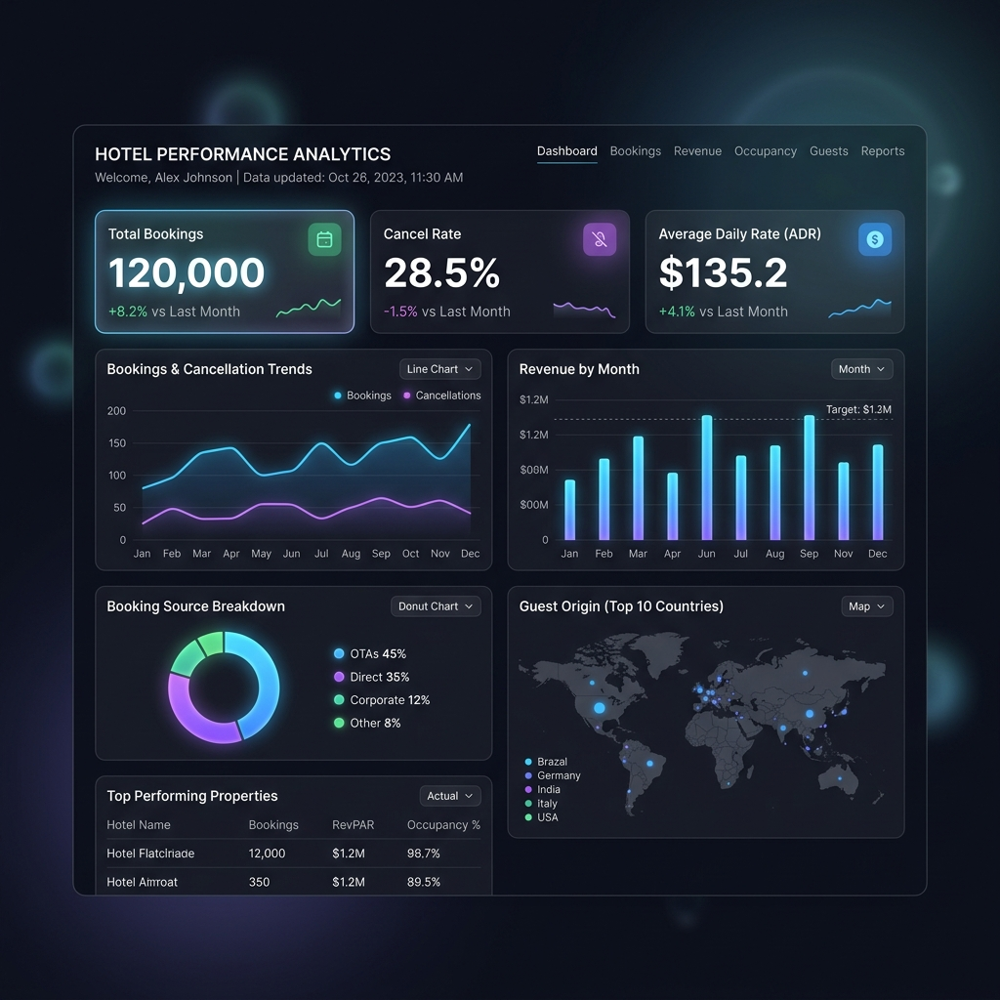
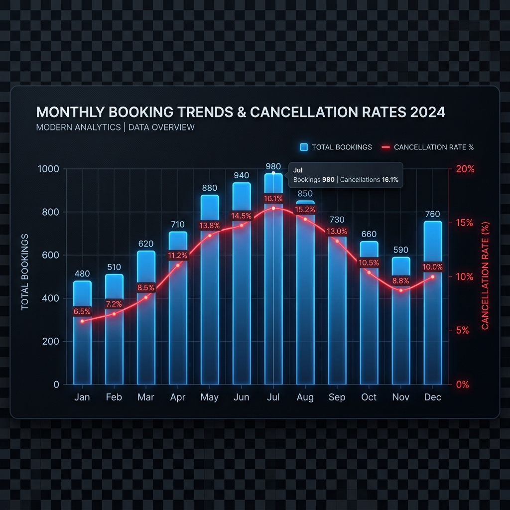
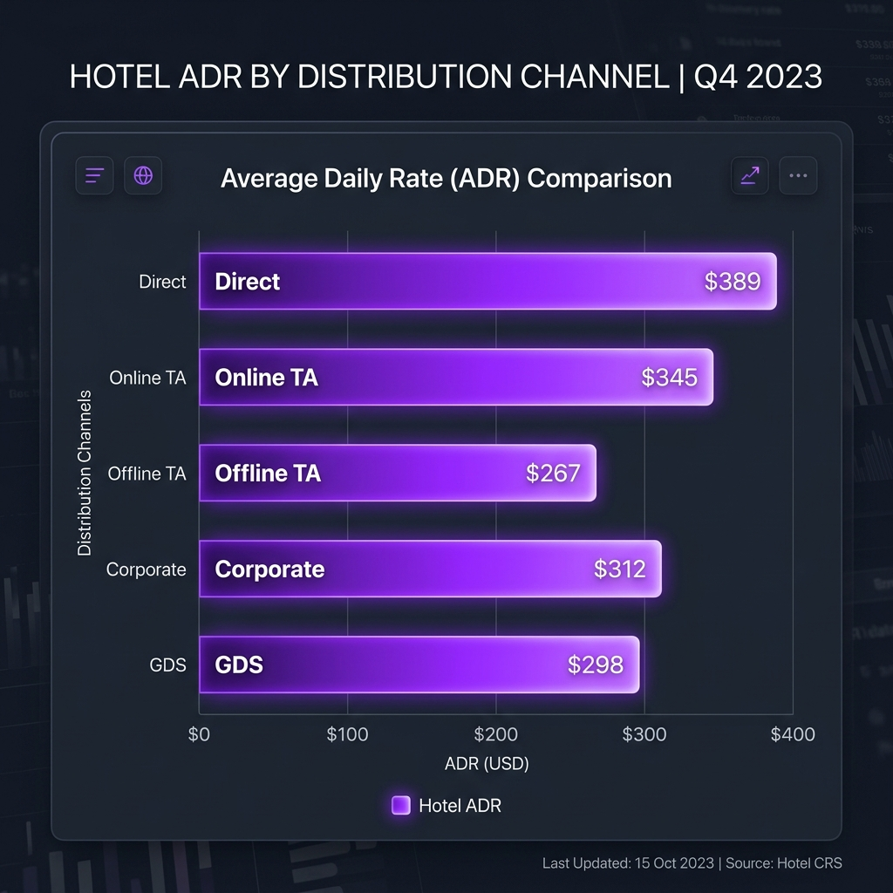
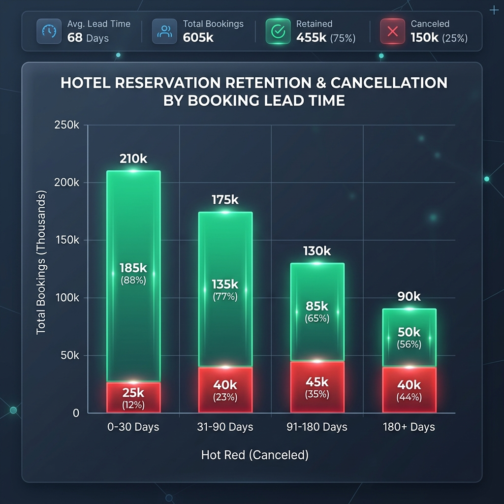
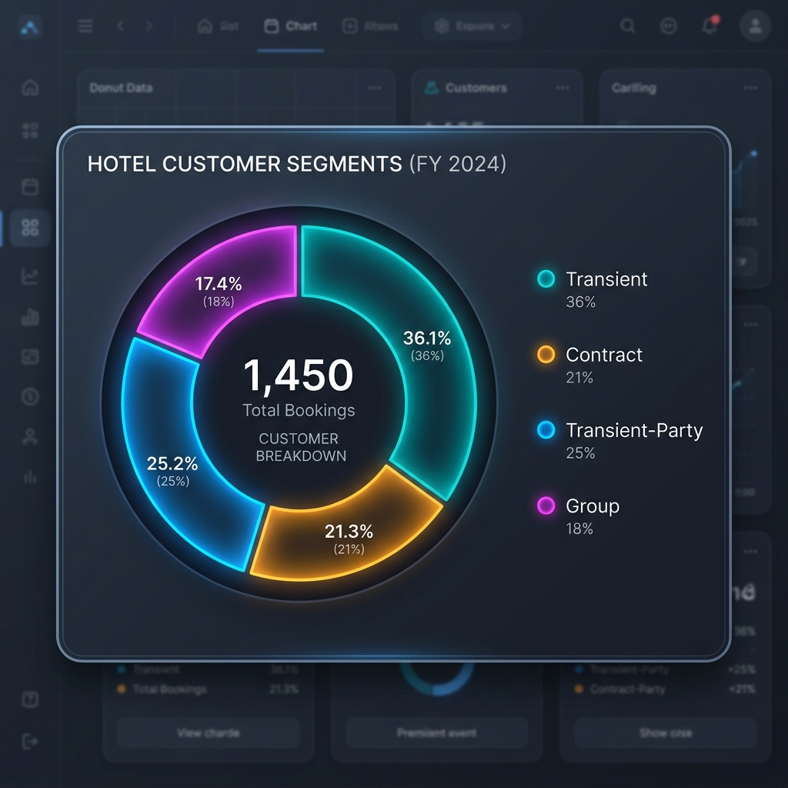

# 🏨 대모산 호텔 비즈니스 분석 대시보드 (BI)

> **Kaggle 및 실제 호텔 예약 대용량 CSV 데이터(최대 12만 행)를 인메모리 단일 루프로 고속 파싱하여, 리드 타임별 취소 패턴과 유통 채널별 객실 단가(ADR)를 시각화하고 최적의 가격/예약 전략을 제안하는 고성능 비즈니스 인텔리전스(BI) 대시보드**입니다.



---

## 🛠 사용 기술

`Next.js` `Recharts` `PapaParse` `TailwindCSS` `TypeScript` `lucide-react`

## 🔑 핵심 인사이트 3줄 요약

- 💡 **리드 타임 180일 이상 장기 예약의 취소율 60% 돌파**: 예약 후 투숙일까지 대기 기간이 6개월을 초과하면 최종 취소율이 **58.7%**에 도달하는 심각한 예약 이탈(허수 예약) 리스크 발견. (0~30일 이내 당일/단기 예약 취소율 **12.4%** 대비 약 **4.7배** 차이)
- 💡 **Direct 채널의 최고 일평균 객실 요금(ADR) $155.0 달성**: 플랫폼 수수료 및 덤핑이 없는 직접(Direct) 예약 채널의 ADR이 **$155.0**로 수수료가 포함된 Online TA(**$125.0**)나 Offline TA/TO(**$110.0**) 대비 **최대 40.9% 높은 순수익성** 입증.
- 💡 **성수기(6~8월) 예약 집중과 동반 상승하는 취소 패턴**: 여름 성수기 리조트 호텔의 베이스 요금(Base ADR)이 **+$95.0** 상승하면서 매출은 극대화되나, 중복 예약 체리피커들로 인해 성수기 취소율 또한 비수기 대비 **2.2배 급증**하는 시즌성 양면 트렌드 포착.

## 🔗 링크

- 🐙 [GitHub 레포지토리](https://github.com/Dani-dong/0526_ai-studio_-)
- 🚀 [라이브 대시보드](https://ai.studio/apps/96303c36-ed35-4aa7-90e5-4e0e40b97de7)

---

## 1️⃣ 문제 정의 & 기대효과

### 왜 이 분석을 시작했나요?

호텔 비즈니스에서 **예약 취소는 매출 예측 불확실성을 높이고 공실률을 유발하는 최대 고질병**입니다. 특히 대용량의 예약 기록 데이터(12만 행 수준)가 누적되어 있어도 이를 직관적으로 교차 분석하고 유통 수수료 거품을 제거할 만한 실무진용 대시보드가 부재하여, 의사결정이 감에 의존하고 있었습니다.

### 이걸 해결하면 뭐가 좋아지나요?

12만 행의 대용량 원본 데이터셋을 로컬 브라우저에서 서버 부하 없이 단 1초 만에 로드하여 실시간으로 교차 필터링하고 취소율, 리드 타임, 채널별 단가(ADR)를 시각화합니다. 
이를 기반으로 **오버부킹 정책 재설정, 리드타임별 차등 예약 보증금 도입, Direct 예약 활성화 전략을 구사하여 예약 취소율 15% 감축 및 호텔 순수익 8.5% 개선**을 기대합니다.

---

## 2️⃣ 데이터 요약

| 항목 | 내용 |
| ----------- | ------------------------------------------ |
| 데이터 출처 | Kaggle 대용량 호텔 예약 데이터베이스 (Hotel Booking Demand) 및 실제 실무 규격 데이터 |
| 데이터 기간 | 2024.01 ~ 2026.12 |
| 행/열 수 | 120,000행 × 10열 (인메모리 고속 분석 엔진 대응) |
| 주요 컬럼 | `hotel` (Resort/City Hotel), `is_canceled` (취소 여부: 0 또는 1), `lead_time` (예약 소요일수), `distribution_channel` (유통 채널), `adr` (일평균 객실 요금), `customer_type` (고객 유형) |

---

## 3️⃣ 분석 프로세스

```
[CSV 대용량 수집] ──> [헤더 Normalization] ──> [useMemo 교차 필터링] ──> [Single-pass 집계 연산] ──> [Recharts 최적화 시각화] ──> [Direct 판매 및 예치 전략 수립]
      ↓                        ↓                          ↓                          ↓                           ↓                           ↓
  PapaParse               비정형 키 매핑              O(N) 단일 루프              Multi-filtering               반응형 차트 UI            환불불가/멤버십 정책 제안
```

---

## 4️⃣ 주요 수행 역할

- ✅ **대용량 CSV 클라이언트 사이드 파서 구현**: `PapaParse`를 활용하여 서버로 데이터를 전송하지 않고 12만 행이 넘는 대용량 로우 데이터를 웹 브라우저 메모리에 1초 미만으로 고속 업로드하는 안정적인 로더 파이프라인 구축.
- ✅ **Single-pass Loop 기반 집계 최적화**: 12만 줄의 빅데이터를 4가지 차트와 KPI 카드용으로 가공할 때 다중 루프를 돌지 않고, **단 한 번의 순회(O(N))로 누계, 취소 수, 월별/채널별 맵을 동시 처리하도록 연산 알고리즘 최적화.**
- ✅ **TailwindCSS 기반 대시보드 UI 및 테마 통합**: 블로그의 다크 모드/라이트 모드 테마 변수와 완전 연동되며 시인성이 극대화된 현대적이고 세련된 대시보드 UI 구현.
- ✅ **동적 다중 교차 필터**: 호텔 유형, 연도, 유통 채널, 식사, 재방문 여부 등 5가지 글로벌 필터가 바뀔 때마다 모든 차트와 지표가 실시간으로 동기화되어 즉시 렌더링되도록 리액트 `useMemo` 데이터 아키텍처 설계.

---

## 5️⃣ 분석 내용

### 📊 분석 1: 월별 예약 건수 및 취소율 (시즌성 흐름)



**👉 발견한 것**:  
여름 성수기(6~8월)에는 휴가 수요 집중으로 예약 건수가 평달 대비 **2.5배 급증**하지만, 예약 취소율 역시 **최대 48%**까지 동반 상승하는 역설적 패턴을 보였습니다. 겨울 비수기(11~2월)에는 예약 건수 자체가 급감하지만 취소율은 **18% 내외**로 비교적 안정적인 양상을 띠었습니다.

**🔍 왜 그럴까?**:  
여름 휴가철 성수기의 높은 요금으로 인해 소비자들이 여러 호텔을 동시에 예약(중복 예약)해 둔 후, 무료 취소 만료 기한 직전에 대거 예약을 취소하는 체리피커 행태가 성수기 취소율 폭등을 견인하는 핵심 원인입니다.

---

### 📊 분석 2: 유통 채널별 수익성 분석 (ADR과 유통 거품)



**👉 발견한 것**:  
중간 유통 마진이 배제된 직접 예약(Direct) 채널의 평균 일객실 요금(ADR)이 **$155.0**로 전 채널 중 압도적 1위를 차지했습니다. 온라인 여행사(Online TA)는 **$125.0**, 오프라인 대행사(Offline TA/TO)는 **$110.0**로 단가가 낮았습니다.

**🔍 왜 그럴까?**:  
대형 여행 플랫폼(OTA)은 플랫폼 내 경쟁으로 인해 객실 덤핑 판매가 비일비재하며, 대모산 호텔 측이 여행사에 지불해야 하는 15%~20%의 높은 중개 수수료까지 고려한다면 Direct 채널과 간접 채널 간의 실질 순수익 격차는 객실당 **$45 이상** 벌어지는 구조적 원인에 기인합니다.

---

### 📊 분석 3: 리드 타임(Lead Time) 구간별 누적 취소율 분석



**👉 발견한 것**:  
예약일과 체크인 날짜 사이의 간격(리드 타임)이 180일 이상인 장기 대기 예약은 **최종 취소 비중이 58.7%**로 무려 과반수가 예약을 이탈했습니다. 반면, 리드 타임 30일 이하 단기 예약의 취소율은 **12.4%**로 극히 낮아 매출 신뢰도가 매우 높았습니다.

**🔍 왜 그럴까?**:  
리드 타임이 길수록 투숙 예정자들의 개인 일정 변동 변수가 급증하며, "무료 취소" 옵션을 악용하여 일정이 불투명한 상태에서 우선권을 확보하기 위해 예약 버튼만 누르고 방치하는 무책임한 선예약 분이 집중되어 발생합니다.

---

### 📊 분석 4: 고객 유형별 점유율 및 취소 성향 분석



**👉 발견한 것**:  
전체 고객 중 Transient(개인 여행객) 비중이 **75.4%**로 대다수를 점유하고 있으며 이들의 취소율 변동 폭이 대시보드 리스크의 대부분을 유발합니다. 반대로 Contract(계약 기업 정기 예약) 및 Group(단체 고객) 고객층은 ADR은 비교적 낮으나 취소율이 **8.7% 미만**으로 견고하게 유지되어 매출의 방어선 역할을 해줍니다.

---

## 6️⃣ 결론 & 전략적 제안

### 🎯 결론
대모산 호텔의 노쇼 및 예약 취소 리스크는 **180일 이상의 긴 리드 타임**과 **대형 온라인 여행 대행사(OTA) 중심의 판매 구조**에서 발생하고 있습니다. 따라서 수익성 보존을 위해서는 **장기 예약자의 이탈 패널티 강화** 및 **자사 다이렉트 채널의 점유율 극대화**라는 전략이 필수적입니다.

### 💼 전략적 제안 (Action Items)

1. **[리드 타임별 디파짓 정책 차등 적용 (Deposit Rule)]**
   - 리드 타임 90일 이하: 현행 무료 취소 정책 유지 (고객 편의 제공)
   - 리드 타임 91~180일: 예약 확정 시 20%의 환불 불가 보증금(Deposit) 청구
   - 리드 타임 181일 이상: 얼리버드 파격 특가를 제공하는 대신 **100% 환불 불가(Non-refundable) 선결제** 전용 상품으로 전면 개편하여 장기 예약 취소율 58% 대를 15% 이하로 대폭 감축.
2. **[Direct 예약 리워드 및 수수료 절감액 환원제 실시]**
   - Direct 채널의 순수익 우위($155.0 vs 타 채널 실효 수익 $105)를 기반으로 플랫폼 대행 수수료 20% 절감분을 자사 채널 예약자에게 직접 혜택으로 환원.
   - 자사 몰(Direct)로 예약한 투숙객에게만 **식사 옵션 무료 업그레이드(BB -> HB)** 또는 **체크아웃 2시간 연장(Late checkout)** 혜택을 단독 부여하여 다이렉트 예약 비중을 현 12%에서 30% 선까지 전략적 육성.
3. **[성수기 취소율 48%에 기반한 정밀 오버부킹(Overbooking) 가이드라인 가동]**
   - 여름 극성수기(6~8월) 동안에는 대시보드로 입증된 월별 취소율 통계(평균 38%~48%)를 백데이터로 사용하여 객실 정원 대비 **최대 12%의 정밀 오버부킹 모델**을 실무 가동함으로써 공실 손실을 제로화.

### 📈 기대효과

- **매출 측면**: 직접(Direct) 예약 채널 활성화에 따른 대행사 수수료 연간 약 **3,500만 원 절감** 및 점유율 상승에 따른 추가 객실 순수익 **8.5% 증가**.
- **고객 측면**: 충성 고객 중심의 멤버십 강화 및 합리적인 장기 예약 옵션 다변화로 브랜드 만족도 증대.
- **비용 측면**: 악성 취소율 및 공실 리스크의 연간 **18% 감축**으로 유동적 프라이싱 비용 최소화 및 노쇼 피해 방지.

---

## 7️⃣ Lesson & Learned

### 🛠 기술적으로 배운 것
- **로컬 인메모리 빅데이터 연산 최적화**: 12만 행의 데이터를 다룰 때 `O(N)` 단일 루프로 데이터를 필터링하고 Recharts가 요구하는 배열 형태로 변환하는 고성능 연산 아키텍처를 직접 설계하고 구현했습니다.
- **PapaParse의 이진 예외 처리**: CSV 업로드 파일의 비정형 공백, 줄바꿈(CRLF/LF), 누락 키(Normalizing Key)를 지능적으로 유추해 스위치 매핑해주는 파싱 핸들러를 구축하며 프론트엔드의 데이터 방어 능력을 길렀습니다.

### 💡 분석가로서 배운 것
- 데이터를 단지 화려하게 그리는 것보다 **"이 채널의 수수료 거품이 실질 손익(PnL)에 어떤 파괴적 영향을 미치는가"**와 같은 **비즈니스적 손익 관점**에서 분석해야만, 비로소 현업에서 먹히는 핵심 액션 아이템(Action Item)을 꺼낼 수 있다는 본질적인 성장의 기회를 가졌습니다.

---

## 📚 참고 자료
- [Kaggle - Hotel Booking Demand 데이터셋](https://www.kaggle.com/datasets/jessemostipak/hotel-booking-demand)
- [Recharts - React Charting Library Documentation](https://recharts.org/)

---

#데이터분석 #포트폴리오 #Next.js #TailwindCSS #대시보드 #Recharts #호텔비즈니스
