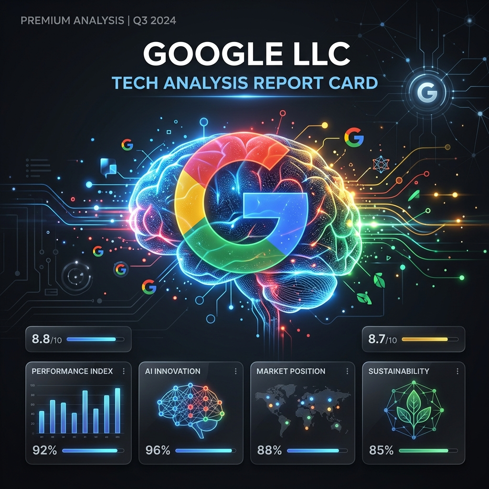

# 🏷 [AI 리포트] Google LLC 분석 요약

> 검색 광고 패러다임의 종말과 생성형 AI 비서로의 전환점에서, 구글은 단순한 정보 탐색 도구를 넘어 사용자의 실시간 행동을 점유하는 통합 AI 생태계로 진화해야만 생존할 수 있다.



---

## 🛠 사용 기술

`Gemini` `SGE` `AI` `Search Engine` `Competitor Analysis`

## 🔑 핵심 인사이트 3줄 요약

- 💡 **AI 검색 및 사상 초유 규제**: AI 검색 전환과 미국 법무부(DOJ) 반독점 규제라는 초유의 이중고에 직면해 있습니다.
- 💡 **비즈니스 모델 체질 개선**: 단순 검색 광고 모델에서 탈피하여 Gemini 기반의 구독 및 에이전트 커머스로 성공적인 체질 개선을 시도하고 있습니다.
- 💡 **사용자 시간 및 점유율 수호**: Z세대의 검색/여가를 잠식하는 틱톡 등에 대응하여 유튜브 숏츠 강화 및 생성형 검색 경험(SGE) 고도화에 사활을 걸고 있습니다.

## 🔗 링크

- 🐙 [GitHub 레포지토리](https://github.com/Dani-dong/Dani-dong.github.io)

---

## 1️⃣ 문제 정의 & 기대효과

### 왜 이 분석을 시작했나요?
최근 생성형 AI와 소셜 플랫폼(OpenAI, TikTok 등)의 급부상으로 기존 구글의 검색 지배력과 광고 기반 비즈니스 모델이 큰 위협을 받고 있습니다. 구글이 처한 현재의 위기 상황과 경쟁 구도를 면밀히 분석하고 앞으로의 생존 방향성을 제시하고자 이 분석을 시작했습니다.

### 이걸 해결하면 뭐가 좋아지나요?
구글의 비즈니스 포트폴리오 다각화 및 Gemini 에이전트와 안드로이드/크롬 생태계의 락인(Lock-in) 전략을 통해 기존 검색 시장의 점유율 방어는 물론, 미래의 AI 플랫폼 주도권을 견고히 유지할 수 있습니다.

---

## 2️⃣ 데이터 요약

| 항목        | 내용                                       |
| ----------- | ------------------------------------------ |
| 데이터 출처 | Google LLC 기업 보고서 및 시장 분석 자료  |
| 분석 범위   | 구글 비즈니스 모델, 경쟁사 동향, 시장 점유율 |
| 주요 키워드 | Gemini, 반독점 소송, 생성형 검색 경험(SGE) |

---

## 3️⃣ 분석 프로세스

```text
[회사 개요 분석] → [경쟁 지형 파악] → [위험 요인 식별] → [미래 대응 전략 도출]
```

---

## 4️⃣ 분석 내용 (WHY-SO-WHAT)

### 📊 분석 1: 회사 개요 및 최근 리스크

구글은 전 세계 검색 시장을 지배하며 디지털 광고, 클라우드 컴퓨팅, 하드웨어 및 소프트웨어 생태계를 이끄는 글로벌 빅테크 기업입니다. 최근에는 자체 거대언어모델(LLM)인 Gemini를 중심으로 서비스 전반에 생성형 AI를 통합하는 데 집중하고 있습니다.

- **주요 고객:** 전 세계 일반 인터넷 사용자, 디지털 광고주, 그리고 클라우드 서비스를 이용하는 기업 고객
- **비즈니스 모델:** 검색 및 유튜브 광고 매출을 중심으로, 구글 클라우드 구독료 및 하드웨어 판매 수익
- **최근 이슈:** 미국 법무부(DOJ)의 반독점 소송 패소 판결 및 이에 따른 기업 분할 가능성 제기

---

### 📊 분석 2: 경쟁 지형 및 주의력(Attention) 전쟁

구글의 경쟁자는 단순한 검색 엔진이 아니라, 고도의 몰입감과 즉각적인 답변으로 사용자의 한정된 주의력과 시간을 빼앗아가는 플랫폼들입니다.

#### 1. OpenAI (대화형 지식 허브)
- **포지셔닝:** 즉각적인 답변 및 대화형 지식 허브
- **위협 요인:** 사용자가 링크를 탐색하는 시간을 없애고 단 한 번의 질문으로 정제된 답변과 솔루션을 제공하여 구글 검색 체류 시간을 직접적으로 흡수합니다.
- [OpenAI 웹사이트 방문하기](https://openai.com)

#### 2. TikTok (숏폼 엔터테인먼트)
- **포지셔닝:** 숏폼 콘텐츠 기반의 엔터테인먼트 및 정보 탐색 플랫폼
- **위협 요인:** Z세대의 검색 및 여가 시간을 숏폼 영상과 알고리즘 추천으로 장악하며, 구글 검색과 유튜브의 체류 시간을 가장 빠르게 잠식하고 있습니다.
- [TikTok 웹사이트 방문하기](https://www.tiktok.com)

#### 3. Netflix (스트리밍 서비스)
- **포지셔닝:** 프리미엄 구독형 비디오 스트리밍 서비스
- **위협 요인:** 고품질 오리지널 콘텐츠를 통해 사용자의 저녁 여가 시간을 독점함으로써 유튜브 및 구글 생태계로의 진입 자체를 원천 차단합니다.
- [Netflix 웹사이트 방문하기](https://www.netflix.com)

---

## 5️⃣ 결론 & 전략적 제안

### 🎯 결론
구글은 반독점 규제와 AI 검색 등장이라는 거대한 물결 속에서, 전통적인 링크 목록 제공 방식에서 벗어나 실시간 행동을 점유하는 종합 AI 비서 플랫폼으로 진화해야만 합니다.

### 💼 전략적 제안 (Action Items)

1. **[생태계 락인] Gemini 에이전트 생태계 통합**:
   구글의 최대 무기인 안드로이드 OS 및 크롬 브라우저에 Gemini 비서를 더 깊숙이 내장하여 사용자가 다른 플랫폼으로 이탈할 틈을 주지 않는 강력한 락인(Lock-in) 환경을 완성해야 합니다.
2. **[채널 경쟁력] 유튜브 숏츠 및 알고리즘 방어**:
   틱톡에 밀리는 Z세대 점유율을 회복하기 위해 유튜브 숏츠의 크리에이터 보상 정책 및 맞춤형 검색 추천 알고리즘을 대폭 강화해야 합니다.
3. **[수익 모델] 구독 서비스 다각화**:
   광고 단가 하락에 대응하여 Gemini Advanced, 구글 원 클라우드 등 고부가가치 AI 기능 중심의 구독 모델 비중을 적극 확대해야 합니다.

---

## 6️⃣ Lesson & Learned

### 💡 분석가로서 배운 것
- 글로벌 거시 시장의 리스크(반독점법 등)와 신기술의 파급 효과가 개별 테크 대기업의 비즈니스 모델에 어떻게 직접적인 타격을 입히는지 입체적으로 분석하는 시각을 가질 수 있었습니다.
- 숏폼 콘텐츠와 AI 채팅 비서가 사용자의 '체류 시간'을 두고 벌이는 플랫폼 전쟁의 본질을 이해하고, 정량적인 위협을 진단하는 역량을 길렀습니다.

---

#데이터분석 #기업분석 #구글 #Google #Gemini #빅테크 #AI트렌드
