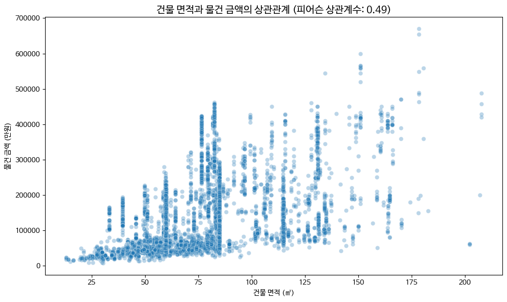
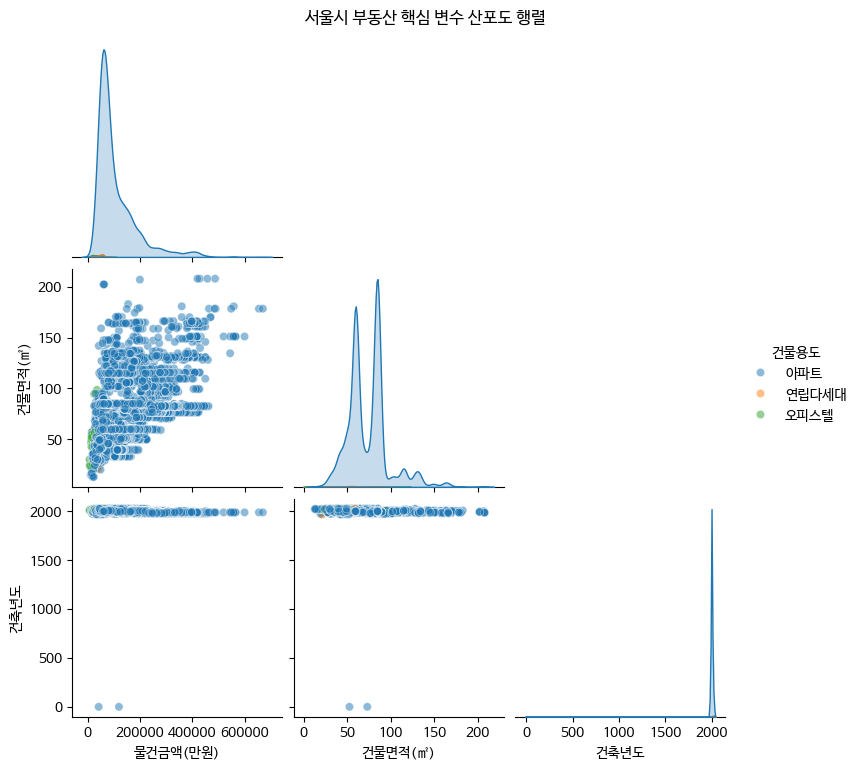
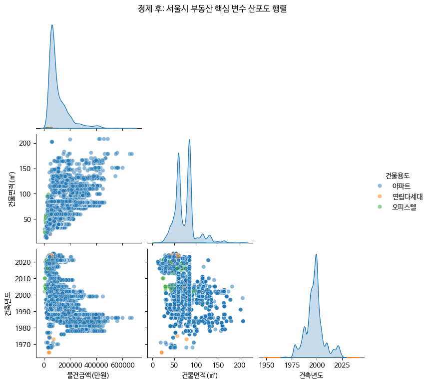

# 🏷 서울시 부동산 실거래가 탐색적 데이터 분석

> 13,038건의 서울시 부동산 실거래가 데이터를 활용한 탐색적 데이터 분석(EDA) 실습



---

## 🛠 사용 기술

`Python` `pandas` `matplotlib` `seaborn` `missingno`

## 🔑 핵심 인사이트 3줄 요약

- 💡 13,038건 중 토지면적 결측치 382건 등 초기 데이터에 결측치가 존재함을 확인
- 💡 건축년도가 '0년'으로 잘못 기입된 4건 등 이상치(Outlier)를 발견 및 정제
- 💡 단순 상관관계를 넘어, 노후 주택일수록 가격이 비싸지는 U자형 패턴(재건축 기대감)이라는 제3의 변수 발견

## 🔗 링크

- 📓 [코랩 노트북 보기](https://colab.research.google.com/drive/1pm_dCozANHQlFmM-N72T4M6OXfeSmEw1?usp=sharing)
- 🐙 [GitHub 레포지토리](#)

---

## 1️⃣ 문제 정의 & 기대효과

### 왜 이 분석을 시작했나요?

수업 시간에 배운 탐색적 데이터 분석(EDA) 기법을 실제 공공데이터인 '서울시 부동산 실거래.csv' 파일에 적용해보기 위한 실습이 목적이었습니다.

### 이걸 해결하면 뭐가 좋아지나요?

실제 데이터를 다루는 과정에서 발생할 수 있는 결측치와 기입 오류를 직접 정제해 봄으로써, 왜곡 없는 정확한 분석 결과를 도출하는 역량을 강화할 수 있습니다.

---

## 2️⃣ 데이터 요약

| 항목        | 내용                                       |
| ----------- | ------------------------------------------ |
| 데이터 출처 | 공공데이터포털 (서울시 부동산 실거래가 정보) |
| 행/열 수    | 13,038행 × 21열                           |
| 주요 컬럼   | 물건금액(만원), 건물면적(㎡), 건축년도, 자치구명 |

---

## 3️⃣ 분석 프로세스

```text
[데이터 수집] → [결측치/이상치 확인] → [데이터 정제] → [EDA (단일/이변량)] → [다변량 분석] → [인사이트 도출]
    ↓                 ↓                 ↓               ↓                  ↓                 ↓
 read_csv        missingno        dropna/drop      scatter/boxplot     pairplot         전략 제안
```

---

## 4️⃣ 주요 수행 역할

- ✅ **데이터 전처리**: 결측치 파악 및 건축년도 '0년' 등 이상 데이터 제거
- ✅ **EDA**: 건물면적과 물건금액 간의 양의 상관관계 시각화 (산점도)
- ✅ **다변량 분석**: 자치구별, 건물용도별 등 범주형 변수를 복합적으로 고려한 차이점 분석
- ✅ **시각화 & 인사이트**: 단일 상관관계 이면에 숨겨진 재건축 기대감(제3의 변수) 도출

---

## 5️⃣ 분석 내용

### 📊 분석 1: 데이터 상태 파악 및 정제 (결측치 확인)

**👉 발견한 것**:  
데이터의 빈칸 분포를 파악한 결과, 토지면적 등에서 결측치(Null)가 다수 존재함을 확인했습니다. 특히 건축년도 변수에서 '0년'으로 잘못 기입된 이상 데이터(Outlier)를 발견했습니다.

**🔍 왜 그럴까?**:  
수기 입력이나 데이터 취합 과정에서의 휴먼 에러로 추정되며, 이를 삭제하는 데이터 정제 작업을 수행하여 분석 결과의 왜곡을 방지했습니다.

---

### 📊 분석 2: 변수 간의 관계 확인 - 이변량 분석



**👉 발견한 것**:  
수치형 변수인 건물면적(㎡)과 물건금액(만원)의 관계를 산점도로 시각화하여, 면적이 넓어질수록 가격이 상승하는 전반적인 양의 상관관계를 확인했습니다.

**🔍 왜 그럴까?**:  
범주형 변수인 자치구명을 더하여 그룹별로 분석해 본 결과, 동일한 면적이라도 위치(자치구)에 따라 인프라와 수요 차이로 인해 금액 차이가 크게 발생하는 것을 알 수 있습니다.

---

### 📊 분석 3: 다변량 분석과 제3의 변수 발견


<br>


**👉 발견한 것**:  
건축년도와 물건금액의 관계를 산점도로 분석하던 중, 지은 지 오래된 노후 주택의 가격이 다시 비싸지는 U자형 패턴을 관찰했습니다.

**🔍 왜 그럴까?**:  
단순히 연식이 오래될수록 가격이 낮아진다는 단편적인 추론을 넘어, '재건축 기대감'이라는 제3의 변수(혼란 변수, Confounding Variable)가 시장에 작용하고 있음을 시사합니다.

---

## 6️⃣ 결론 & 전략적 제안

### 🎯 결론

부동산 가격은 단순 면적과 비례하지 않으며, 자치구와 재건축 기대감 등 다양한 범주형 및 외부 변수가 복합적으로 작용함을 확인했습니다.

### 💼 전략적 제안 (Action Items)

1. **시각화 기반의 데이터 검증 체계 마련**: 데이터를 분석하기 전, 막대그래프나 빈도표 등을 활용하여 데이터의 형태와 기입 오류(예: 건축년도 0년)를 먼저 시각적으로 점검하는 단계를 필수적으로 거쳐야 합니다.
2. **다각도 분석 지표 활용**: 부동산 가격을 파악할 때 면적이라는 단일 수치에만 의존하지 않고, 교차표나 히트맵을 통해 자치구명, 건물용도 등 범주형 변수들이 복합적으로 미치는 영향을 함께 고려해야 합니다.
3. **상관관계와 인과관계의 분리 해석**: 그래프에 나타난 겉보기 상관관계를 즉각적인 인과관계로 단정 짓지 않아야 하며, 부동산 가격의 U자형 곡선 사례처럼 숨겨진 제3의 변수를 신중하게 검토해야 합니다.

### 📈 기대효과

- **분석 측면**: 기계적 수치 해석을 벗어난 입체적인 데이터 통찰력 확보
- **의사결정 측면**: 왜곡된 지표에 의한 오판을 방지하고 현업 비즈니스 맥락에 맞는 정확한 의사결정 지원

---

## 7️⃣ Lesson & Learned

### 🛠 기술적으로 배운 것

- matplotlib와 seaborn을 활용해 히스토그램, 산점도, 박스플롯, 산포도 행렬 등을 그리며 EDA의 기본기를 다졌습니다.
- 결측치나 오류 데이터를 코드로만 찾기보다 직접 확인했을 때 직관적인 파악이 가능함을 배웠습니다.

### 💡 분석가로서 배운 것

- 앤스콤의 4분면 예제처럼, 숫자로 된 요약 통계량만 믿고 접근하는 것이 얼마나 위험한지 깨달았습니다.
- 데이터 간의 상관관계가 인과관계를 보장하지 않는다는 사실을 배웠으며, 현상 뒤에 숨겨진 진짜 이유(제3의 변수)를 고민할 줄 아는 시각을 길렀습니다.

### 🚀 다음에 더 해보고 싶은 것

- 특정 자치구나 아파트 단지를 타겟으로 한 시계열 트렌드 분석

---

## 📚 참고 자료

- [서울시 부동산 실거래가 정보 (공공데이터포털)]()

---

#데이터분석 #포트폴리오 #pandas #Python #EDA
