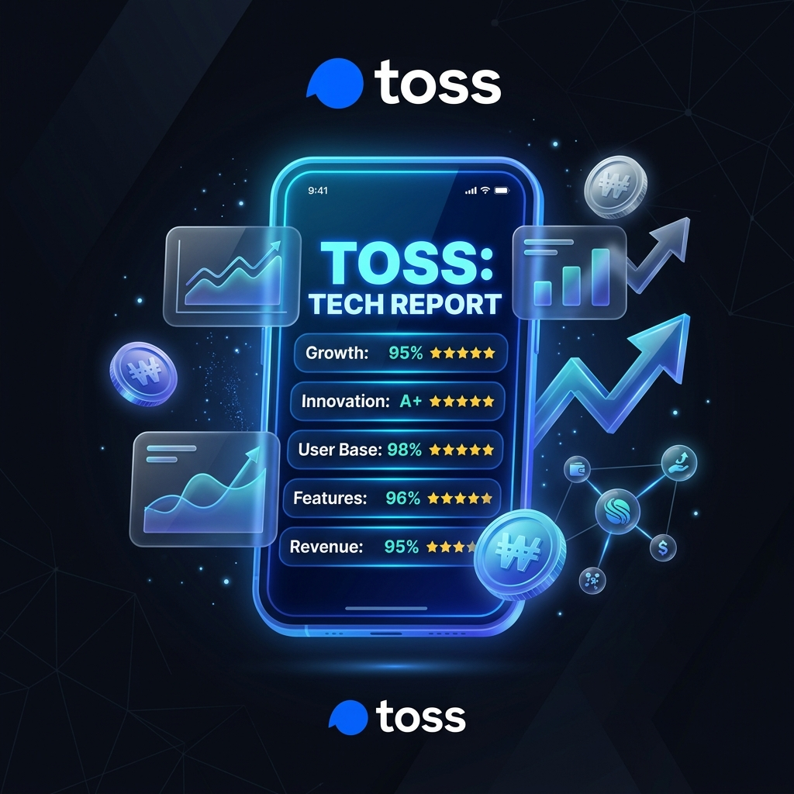

# 🏷 [기업분석] 비바리퍼블리카 (토스) 분석 요약

> 토스는 단순 금융 앱을 넘어 게이미피케이션과 커뮤니티를 결합해 유저의 일상 점유율을 극대화하는 '금융 기반의 타임라인 플랫폼'으로 진화하고 있다.



---

## 🛠 사용 기술

`Fintech` `Super-App` `RAG` `LLM` `Gamification`

## 🔑 핵심 인사이트 3줄 요약

- 💡 **수퍼앱에서 타임라인 플랫폼으로**: 토스는 단순한 금융 송금 앱을 넘어, 게이미피케이션(앱테크)과 광고판을 결합한 일상적인 주의력 점유 플랫폼으로 진화하고 있습니다.
- 💡 **트래픽의 본격적인 수익화**: 2025년 기업공개(IPO)를 본격 준비하는 시점에서, 플랫폼 내 방대한 트래픽을 고마진 광고 비즈니스로 전환하여 수익성을 극대화하고 있습니다.
- 💡 **AI 및 RAG 기반 운영 최적화**: RAG(검색증강생성) 및 대규모 언어모델(LLM)을 고객상담(Toss CX) 및 규제 준수 심사에 선제적으로 통합하여 신규 상품 심사 기간을 2주에서 2일로 대폭 단축하는 혁신적인 가설을 세웠습니다.

## 🔗 링크

- 🐙 [GitHub 레포지토리](https://github.com/Dani-dong/Dani-dong.github.io)
- 🚀 [토스 공식 홈페이지](https://toss.im)

---

## 1️⃣ 문제 정의 & 기대효과

### 왜 이 분석을 시작했나요?
최근 모바일 플랫폼 간의 국경 없는 '체류 시간 전쟁'이 가속화되면서, 금융 플랫폼 역시 송금 기능만으로는 생존할 수 없게 되었습니다. 국내 최고 핀테크 유니콘인 토스의 현재 포지셔닝과 경쟁 지형을 파악하고, 다가올 IPO에 발맞춘 운영 자동화 전략을 제시하고자 이 분석을 수행했습니다.

### 이걸 해결하면 뭐가 좋아지나요?
토스의 트래픽을 정교한 AI 광고 엔진으로 수익화하여 기업 가치를 높이고, 금융 규제 및 고객 대응 업무를 LLM으로 자동화하여 백오피스 운영 비용을 획기적으로 개선하는 비즈니스 임팩트를 기대할 수 있습니다.

---

## 2️⃣ 데이터 요약

| 항목        | 내용                                       |
| ----------- | ------------------------------------------ |
| 데이터 출처 | 비바리퍼블리카 공시자료, 토스 피드, 보도자료 |
| 분석 범위   | 토스 비즈니스 모델, 경쟁 플랫폼 동향, AI 적용 기회 |
| 핵심 키워드 | 토스뱅크, RAG, 게이미피케이션, IPO 준비    |

---

## 3️⃣ 분석 프로세스

```text
[회사 개요 분석] → [주의력 경쟁 지형 파악] → [업무 자동화 기회 도출] → [전략적 So What 제안]
```

---

## 4️⃣ 분석 내용 (WHY-SO-WHAT)

### 📊 분석 1: 회사 개요 및 최근 리스크

토스는 송금, 계좌 관리, 증권, 은행, 보험 등 모든 금융 서비스를 하나의 앱에서 제공하는 대한민국 대표 금융 수퍼앱입니다. 최근에는 공동구매, 만보기, 고양이 키우기 등 게이미피케이션 요소를 도입하여 비금융 영역에서도 유저 체류 시간을 빠르게 늘려가고 있습니다.

- **주요 고객:** 모바일 금융 거래와 일상적 앱테크를 즐기는 10대부터 60대까지의 전 연령층 모바일 사용자
- **비즈니스 모델:** 금융 상품 중개 수수료, 광고 매출, 증권 거래 수수료 및 은행 이자 수익
- **최근 이슈:** 토스뱅크의 흑자 전환 지속 및 토스증권의 해외 주식 서비스 흥행을 바탕으로 한 기업공개(IPO) 준비 본격화

---

### 📊 분석 2: 주의력(Attention) 경쟁 지형

토스의 경쟁 상대는 단순 금융 앱이 아니라, 강력한 체류 시간과 트래픽을 바탕으로 유저의 일상을 점유하는 빅테크 및 콘텐츠 플랫폼입니다.

#### 1. 카카오 (일상 생활 플랫폼)
- **포지셔닝:** 국민 메신저 기반의 일상 생활 플랫폼
- **주의력 점유:** 압도적인 메신저 네트워크 효과를 바탕으로 선물하기, 페이, 뱅킹 등 생활 밀착형 서비스를 유기적으로 연결하여 유저가 앱을 떠나지 못하게 만듭니다.
- [카카오 공식 홈페이지](https://www.kakaocorp.com)

#### 2. 유튜브 (글로벌 1위 미디어 플랫폼)
- **포지셔닝:** 글로벌 넘버원 동영상 및 정보 소비 플랫폼
- **주의력 점유:** 알고리즘 기반의 무한 콘텐츠 피드를 통해 유저의 여가 시간을 가장 많이 점유하며, 최근 쇼핑 및 커뮤니티 기능을 강화해 커머스 영역까지 위협하고 있습니다.
- [유튜브 공식 홈페이지](https://www.youtube.com)

#### 3. 네이버 (쇼핑 및 검색 포털)
- **포지셔닝:** 검색 및 쇼핑 중심의 포털 플랫폼
- **주의력 점유:** 검색, 쇼핑, 페이, 웹툰, 블로그로 이어지는 강력한 락인(Lock-in) 생태계를 구축하여 유저의 목적형 탐색 시간과 소비 시간을 동시에 독점합니다.
- [네이버 공식 홈페이지](https://www.navercorp.com)

---

### 📊 분석 3: LLM 및 자동화 워크플로우 기회

토스의 방대한 금융 데이터와 유저 행동 로그를 LLM 및 자동화 워크플로우와 결합하면 운영 효율성을 극대화할 수 있습니다.

| 번호 | 자동화 영역 | 현재 반복 업무 | 자동화 가설 | 기대 효과 (숫자 중심) | 우선순위 |
| :--- | :--- | :--- | :--- | :--- | :---: |
| **01** | **개인화 금융 콘텐츠** | 에디터들이 매일 수작업으로 시황을 분석하고 콘텐츠 제작 | 실시간 금융 API와 LLM을 연동해 유저의 포트폴리오별 리포트 실시간 작성 | 콘텐츠 생산 비용 **80% 절감**, 클릭률(CTR) **35% 향상** | **High** |
| **02** | **규제 및 약관 심사** | 준법감시실에서 수백 페이지의 규제 가이드라인 수동 검토 | 금감원 규정집과 사내 약관 RAG 기반 LLM 학습 및 조항 실시간 탐지/추천 | 신규 상품 출시 심사 기간을 **2주에서 2일**로 대폭 단축 | **High** |
| **03** | **고객 VOC 대응** | 고객 문의 카테고리 수동 분류 및 유사 답변 조회 작성 | 멀티모달 LLM으로 캡처 화면과 문의를 분석해 해결책을 즉시 매핑/이관 | 단순 문의 해결 시간 **50% 단축**, 만족도(CSAT) **20% 개선** | **High** |

---

## 5️⃣ 결론 & 전략적 제안

### 🎯 결론
토스는 단순 트래픽 규모 성장을 넘어 다가올 IPO에서 높은 밸류에이션을 인정받기 위해, 확보된 엄청난 유저 트래픽을 AI를 결합한 고부가 타겟 광고 모델로 연결해야 하며 비즈니스 백오피스의 극한 효율성을 달성해야 합니다.

### 💼 전략적 제안 (Action Items)

1. **[타겟팅 고도화] LLM 기반 광고 매칭 엔진 개발**:
   유저의 일상적 금융 로그와 라이프스타일 패턴(만보기, 공동구매 등)을 실시간 분석하는 초개인화 LLM 광고 타겟팅 엔진에 우선 투자하여 광고 효율을 개선해야 합니다.
2. **[컴플라이언스 최적화] RAG 기반 약관 심사 파이프라인 도입**:
   규제 리스크 대응을 고속화하기 위해 RAG 기반의 내부 심사 시스템을 우선 탑재하여 법무/규제 검토 프로세스를 병목 현상 없이 처리해야 합니다.
3. **[게이미피케이션 강화] 금융 콘텐츠 에이전트 접목**:
   유저의 자산 변동 사항이나 소비 트렌드를 바탕으로 AI 에이전트가 흥미로운 금융 팁을 챗봇 형태로 제시하는 대화형 체류 시간 강화 전술을 적용해야 합니다.

---

## 6️⃣ Lesson & Learned

### 💡 분석가로서 배운 것
- 핀테크 리더로서 금융 플랫폼의 비즈니스 모델이 궁극적으로 '시간을 점유하고 이를 광고와 빅데이터로 수익화하는 매체 성격'을 띤다는 점을 파악했습니다.
- RAG 시스템을 활용하여 금융업의 가장 치명적인 병목인 '컴플라이언스(규제) 검토'를 극적으로 단축할 수 있는 기술적 아키텍처 가설을 설계하며 혁신적 접근 능력을 길렀습니다.

---

#데이터분석 #기업분석 #토스 #비바리퍼블리카 #Toss #핀테크 #수퍼앱
